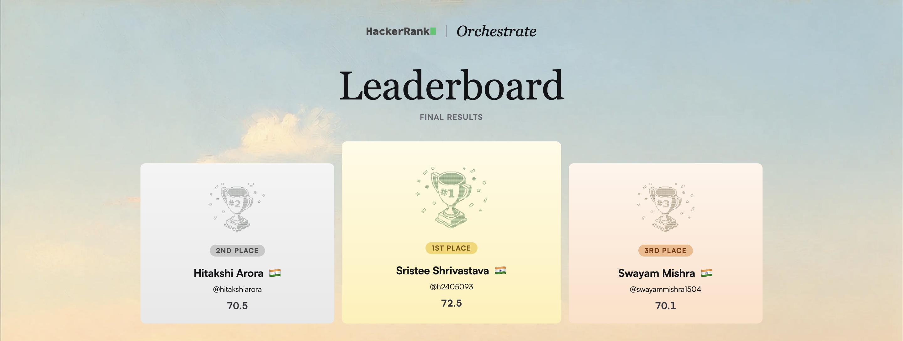

# Multi-Modal Evidence Review

> 🏆 **#1 globally — HackerRank Orchestrate, June 2026** · Final score **72.5 / 100**
> 15,295 registered · 2,039 shipped a working agent




A single-agent system that reviews insurance damage claims from **submitted photos**, a **claim
conversation**, the claimant's **history**, and a **minimum-evidence rulebook** — and returns a
structured, auditable verdict for each claim: `supported`, `contradicted`, or
`not_enough_information`, plus the supporting fields a human reviewer needs to see *why*.

The design rests on one decision: **the model only looks and describes; deterministic Python code
enforces the rules.** A vision model is good at reading a photo and bad at being un-talk-out-of-able;
plain code is the reverse. Splitting the two is what makes the system auditable, hard to manipulate,
and reproducible where it matters.

---

## What it produces

For every claim, the agent emits a fixed 14-column row: the 4 input columns passed through, then 10
decision columns — `evidence_standard_met` (+ reason), `risk_flags`, `issue_type`, `object_part`,
`claim_status` (+ justification), `supporting_image_ids`, `valid_image`, and `severity`. Allowed
values for every field live in one place (`core/schema.py`) so the prompt, the validator, and the
output can never drift apart.

---

## Architecture

One model drives a bounded tool-calling loop per claim. All images are attached up front; the model
decides when it has seen enough to commit. Three tools, each with one narrow job:
`inspect_image` (model-driven closer look at one image), `lookup_evidence_requirement`
(deterministic reference lookup), and `submit_verdict` (the forced structured final answer).

```
claims.csv + images + user_history.csv + evidence_requirements.csv
        │
        ▼
Deterministic loading            core/data_loader.py   (no model calls; images resized to 896px)
        │
        ▼
Agentic tool loop                core/agent.py
  · inspect_image                (model-driven, capped at 2 / claim)
  · lookup_evidence_requirement  (deterministic dict lookup)
  · submit_verdict               (model decides when done; hard cap: 4 iterations + 1 backstop)
        │
        ▼
Schema validation                core/schema.py        (three-tier value matching → output vocab)
        │
        ▼
Deterministic safety gate        core/safety_gate.py   (pure rules; no model calls)
  · manipulation attempts        → cannot support a claim (hard block)
  · non-original images          → manual review, not an automatic downgrade
  · user-history risk            → computed in code, never by the model
        │
        ▼
output.csv   (14 columns, fixed order)
```

A single failing claim never crashes a batch: `core/pipeline.py` degrades a broken claim to a
conservative, clearly-flagged fallback row (`not_enough_information`, `manual_review_required`) so
`output.csv` always has exactly one row per input.

---

## Key design decisions

**Safety gate in code, not in the prompt.** Prompt instructions can be argued away by adversarial
image content; post-model rules cannot. The gate enforces consequences the model can't override — a
flagged manipulation attempt can never be the sole basis for a `supported` verdict, and history-risk
flags are computed deterministically from the data, not from the model's guess.

**`non_original_image` is handled with a scalpel, not a hammer.** Treating "this looks like stock
photography" the same as "this image is a note telling me to approve the claim" produced false
downgrades on claims with genuinely strong, directly-observed damage. So a non-original flag always
forces manual review, but only overrides a `supported` verdict when the model couldn't point to a
single concrete supporting image — mirroring how a human reviewer actually behaves.

**Images up front, `inspect_image` for genuine uncertainty.** A model can't sensibly choose which
image to fetch first without seeing any of them, so all images attach in turn one. `inspect_image`
is then a real model decision (re-look with a focus question), not a scripted sequence — and it's
capped, because each re-attachment re-sends a full image through the stateless message history.

**Three-tier schema matching.** Stronger models produce *richer* field values — `"rear quarter
panel"` where the vocabulary says `quarter_panel`, `"deep dent"` where it says `dent`. Naive exact
matching silently collapses these to `unknown` and punishes the model for being more specific than
the schema. A three-tier matcher (exact → normalized → token-subset) recovers them correctly.

**Provider-agnostic by construction.** Anthropic, OpenAI, Groq, and Gemini sit behind one small
interface (`run_turn`, `build_image_blocks`, `batch_tool_results`, …). Provider quirks are handled
at the provider level and are invisible to the agent loop — e.g. Anthropic requires every
`tool_result` for one turn batched into a single message, while the chat-completions providers
accept separate ones. This makes the cross-provider comparison in `evaluation/` genuinely
apples-to-apples.

**Cost is bounded on purpose.** Images are resized to 896px on the longest side (chosen to still
preserve watermark text and injected-note handwriting on the cases where that matters), iterations
are capped, and `inspect_image` is budgeted. The caps follow the loop's cost structure: because each
iteration re-sends the full accumulated message history under a stateless API, cost compounds with
iteration count rather than growing linearly, so a low iteration cap matters more than it first looks.

---

## Adversarial cases handled

| Pattern                                       | Flag                       | Action                                |
| --------------------------------------------- | -------------------------- | ------------------------------------- |
| In-image instruction ("approve this claim")   | `text_instruction_present` | Hard block — cannot support           |
| Signs of edited / manipulated image           | `possible_manipulation`    | Hard block — cannot support           |
| Stock-photo / non-original image              | `non_original_image`       | Manual review; downgrade only if no concrete supporting image |
| Wrong object photographed (toy car, food can) | `wrong_object`             | Contradiction signal                  |
| Risky claimant history                        | `user_history_risk`        | Computed in code; adds caution, never flips a well-evidenced verdict |

---

## Project structure

```
.
├── main.py                     batch runner: claims.csv → output.csv
├── requirements.txt
├── .env.example
├── core/
│   ├── agent.py                the agentic tool-calling loop
│   ├── schema.py               output schema + allowed values + token-subset validation
│   ├── safety_gate.py          deterministic post-model rules
│   ├── pipeline.py             per-claim orchestration + fallback row
│   ├── tools.py                tool schemas + deterministic tool execution
│   ├── data_loader.py          CSV + image loading, history risk, image resize
│   └── providers/              anthropic · openai · groq · gemini (one shared interface)
└── evaluation/
    ├── main.py                 multi-provider scoring against the labeled sample
    └── metrics.py              per-field metrics + per-row mismatch reporting
```

---

## Providers

| Provider  | Model                                         |
| --------- | --------------------------------------------- |
| Anthropic | `claude-sonnet-4-6`                           |
| OpenAI    | `gpt-4o`                                       |
| Groq      | `meta-llama/llama-4-scout-17b-16e-instruct`   |
| Gemini    | `gemini-2.5-flash`                            |

All four implement the same interface. The evaluation harness runs every provider that has a working
key against the labeled sample, scores each one, and selects the best by field accuracy; any provider
whose key is missing or whose quota is exhausted is skipped (and noted) rather than crashing the run.

---

## Evaluation

`evaluation/main.py` scores predictions against the labeled `sample_claims.csv` **field by field**
rather than as a single blended accuracy number — deliberately, so that a correct label paired with
an empty or generic justification can be caught rather than hidden. It reports:

- per-field accuracy across the exact-match fields,
- a `claim_status` confusion matrix, with per-row detail for any disagreement (so the costly
  `contradicted → supported` direction can be traced to a specific row),
- set-based (Jaccard) similarity for `risk_flags`, since flag-order differences shouldn't zero a row,
- a justification-groundedness rate (does the justification reference a specific image id),
- and an operational accounting: model calls, tokens, latency, and an extrapolated cost estimate.

The harness checkpoints after every row and resumes by default, so a run interrupted by a provider
rate limit can be continued without re-paying for completed rows (`--no-resume` forces a clean run;
`--token-budget N` stops gracefully before hitting a hard cap). A successful run writes
`evaluation/evaluation_report.md`.

A generated [`evaluation/evaluation_report.md`](evaluation/evaluation_report.md) is included, produced
from a real 20-row Anthropic run.

## Results

Measured on the labeled `sample_claims.csv` (20 rows, Anthropic / Claude, 0 fallbacks):

| Field | Accuracy |
| --- | --- |
| `claim_status` (main verdict) | 65% (13/20) |
| `evidence_standard_met` | 70% |
| `object_part` | 70% |
| `valid_image` | 65% |
| `issue_type` | 35% |
| `severity` | 25% |
| Justifications grounded in a specific image id | 100% |

These are honest, modest numbers on a small sample. The system errs **conservative** — its main error
mode is under-calling a genuine `supported` claim as `not_enough_information` rather than wrongly
approving one, which is the safer direction to fail in for a claims-review setting. Raw field accuracy
(especially `issue_type` and `severity`) is the clearest area for future work; the design strengths
here are the auditability and the deterministic safety guarantees, not headline accuracy. Full
per-class breakdown, the confusion matrix, and the cost/latency analysis are in the report linked above.

---

## Setup

```bash
python3 -m venv .venv && source .venv/bin/activate
pip install -r requirements.txt
cp .env.example .env          # add whichever provider keys you have
```

Keys are read from the environment (via `.env`, loaded with `python-dotenv`). Never hardcode them.

### Dataset

The challenge dataset is **not included** — it belongs to HackerRank. To run against your own data,
provide a `dataset/` directory containing `claims.csv`, `sample_claims.csv`, `user_history.csv`,
`evidence_requirements.csv`, and an `images/` tree, matching the column formats the loaders expect
(`core/data_loader.py`).

By default both entry points look for `dataset/` **as a sibling of the repository root** (i.e.
`../dataset` relative to the repo). `main.py` accepts `--dataset-root /path/to/dataset` to point
elsewhere; the evaluation harness currently uses the sibling location.

## Running

```bash
# Score the labeled sample set first (sanity check)
python evaluation/main.py --provider anthropic

# Run on the full claims set
python main.py --provider anthropic --output output.csv

# Smoke-test on the first few rows
python main.py --provider anthropic --limit 5

# Verbose: show each turn's reasoning and tool calls, not just token counts
AGENT_VERBOSE=1 python evaluation/main.py --provider anthropic
```

---

## License

Released under the MIT License — this covers the code in this repository only. The original problem
statement and the challenge dataset belong to HackerRank and are deliberately not included here.